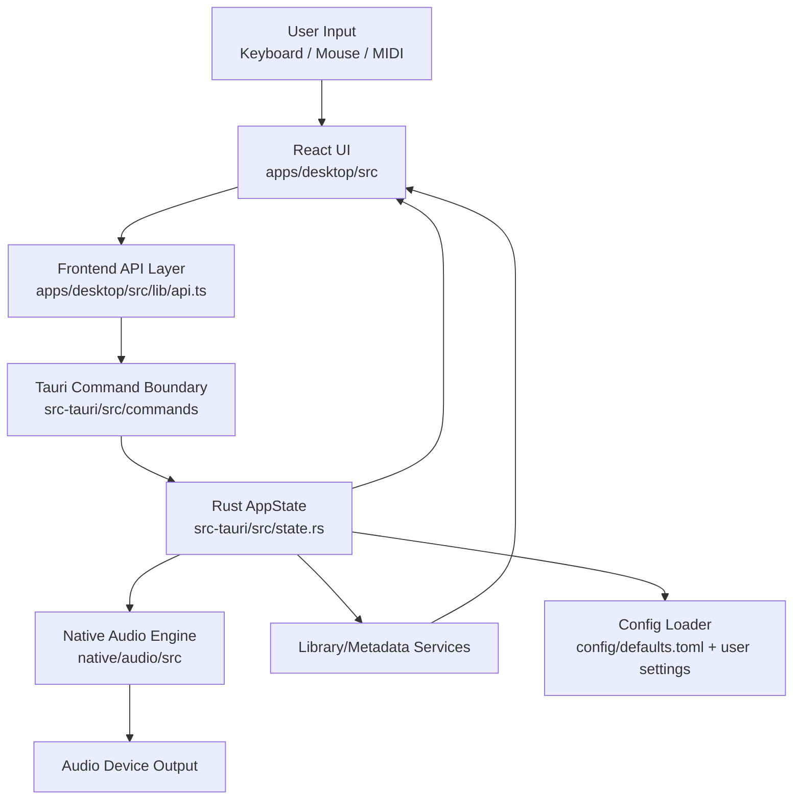
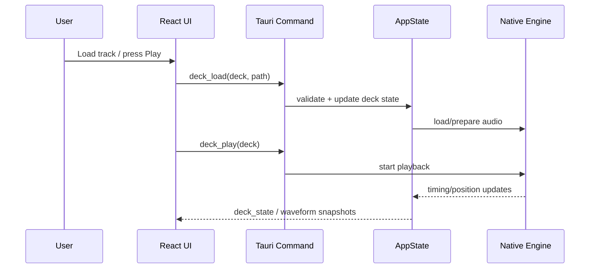

# App Flowchart

**Audience:** Developers and maintainers  
**Owner:** Core maintainers  
**Last reviewed:** 2026-05-02

## End-to-end request flow

```mermaid
flowchart TD
    U[User Input\nKeyboard / Mouse / MIDI] --> UI[React UI\napps/desktop/src]
    UI --> API[Frontend API Layer\napps/desktop/src/lib/api.ts]
    API --> TAURI[Tauri Command Boundary\nsrc-tauri/src/commands]
    TAURI --> STATE[Rust AppState\nsrc-tauri/src/state.rs]
    STATE --> AUDIO[Native Audio Engine\nnative/audio/src]
    STATE --> LIB[Library/Metadata Services]
    STATE --> CFG[Config Loader\nconfig/defaults.toml + user settings]
    AUDIO --> OUT[Audio Device Output]
    LIB --> UI
    STATE --> UI
```

## Playback flow

```mermaid
sequenceDiagram
    participant User
    participant UI as React UI
    participant Cmd as Tauri Command
    participant State as AppState
    participant Engine as Native Engine

    User->>UI: Load track / press Play
    UI->>Cmd: deck_load(deck, path)
    Cmd->>State: validate + update deck state
    State->>Engine: load/prepare audio
    UI->>Cmd: deck_play(deck)
    Cmd->>Engine: start playback
    Engine-->>State: timing/position updates
    State-->>UI: deck_state / waveform snapshots
```
